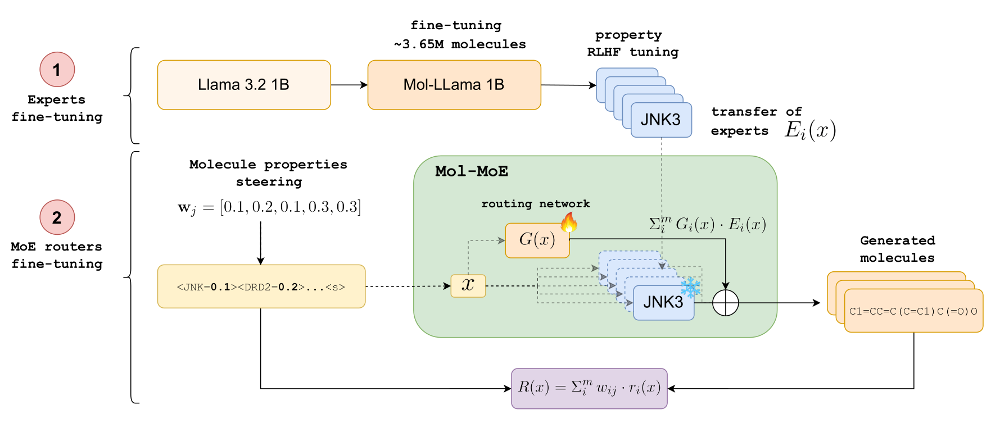

# [Mol-MoE: Training Preference-Guided Routers for Molecule Generation](https://arxiv.org/abs/2502.05633)
[](https://arxiv.org/abs/2502.05633)
 
[](https://huggingface.co/collections/ddidacus/molecule-generation-models-678ad87b0c28503bf9b838a7)

**Authors**: Diego Calanzone, Pierluca D'Oro, Pierre-Luc Bacon. <br>
**Affiliation**: Mila Quebec AI Institute, Universite de Montreal.

**Abstract**: Recent advances in language models have enabled framing molecule generation as sequence modeling. However, existing approaches often rely on single-objective reinforcement learning, limiting their applicability to real-world drug design, where multiple competing properties must be optimized. Traditional multi-objective reinforcement learning (MORL) methods require costly retraining for each new objective combination, making rapid exploration of trade-offs impractical. To overcome these limitations, we introduce Mol-MoE, a mixture-of-experts (MoE) architecture that enables efficient test-time steering of molecule generation without retraining. Central to our approach is a preference-based router training objective that incentivizes the router to combine experts in a way that aligns with user-specified trade-offs. This provides improved flexibility in exploring the chemical property space at test time, facilitating rapid trade-off exploration. Benchmarking against state-of-the-art methods, we show that Mol-MoE achieves superior sample quality and steerability.



## Using the model

> 🤗: [**HuggingFace models** available here!](https://huggingface.co/collections/ddidacus/molecule-generation-models-678ad87b0c28503bf9b838a7)

`Mol-MoE` is a mixture of experts model based on `Llama-3.2-1B`, thus it works as a decoder-only transformer on auto-regressive generation. `Mol-MoE` is fine-tuned to generate molecules in the SMILES format wrt. desired properties. For unconditioned SMILES generation, use the BOS token `<s>`. For conditioned generation, you can target the following properties: JNK3, DRD2, GSK3B, CYP2D6, CYP2C19.
```
    prompt: <JNK3=0.3><DRD2=0.7><GSK3B=0.2><CYP2D6=0.8><CYP2C19=0.8><s> 
```
An example of the generation pipeline:
```
    from transformers import AutoTokenizer, AutoModelForCausalLM
    import re

    # Setup
    device = "cuda"
    tokenizer = AutoTokenizer.from_pretrained("ddidacus/Mol-MoE-6x1b")
    model = AutoModelForCausalLM.from_pretrained("ddidacus/Mol-MoE-6x1b")
    generation_kwargs = {
        "max_new_tokens": 128,
        "min_length": -1,
        "top_k": 0.0,
        "top_p": 0.9,
        "do_sample": True,
        "pad_token_id": tokenizer.eos_token_id,
        "temperature": 1.0
    }

    # Inference
    query = "<JNK3=0.3><DRD2=0.7><GSK3B=0.2><CYP2D6=0.8><CYP2C19=0.8><s>"
    toks = tokenizer([query], return_tensors="pt")["input_ids"].to(device)
    output = model.generate(toks, **generation_kwargs)
    output = tokenizer.batch_decode(output)

    # Parsing
    filter = r'<s>(.*?)</s>'
    molecule = re.findall(filter, output[0], re.DOTALL)
```

### Visualizing the generated compounds
We suggest using the open software [DataWarrior](https://openmolecules.org/datawarrior/download.html). You can generate a set of molecules with `Mol-MoE`, or any other model, with the script:
```
    bash scripts/dataprocessing/generate_molecules.sh
```
You can then import the generated `.csv` file with `DataWarrior` and generate the structures from the SMILES, more information [here](https://pubs.acs.org/doi/10.1021/ci500588j#:~:text=If%20DataWarrior%20opens%20a%20text,valid%20SMILES%20(22)%20codes.). You can also download a workspace `.dwar` file to open directly, it contains a set of pre-generated SMILES with our model:
```
    gdown 1rTaHTIZSPVMkPc9PeJSY-iryQap72IDS
```
You will be able to filter and browse structures with a WYSIWYG interface :)


## Installation
You will need to have [miniconda](https://docs.anaconda.com/miniconda/install/) installed. <br>
To get started, you can launch the setup script:
```
    bash setup.sh
```
It will do for you:
- creation of the directories necessary to run the experiments
- installation of the project environment (contained in `environment.yml`)
- installation of the python package `molgen`, necessary to run the experiments
- download of the dataset (ZINC 250k + MOSES + CHEMBL = ~3.65M compounds)
- download of the classifiers not included in `PyTDC`: `CYP2C19, CYP2D6`


The repo follows the structure:
```
    - assets/       # visualization
    + configs/      # fine-tuning configs
        - merging/  # merging configs
    + datasets/     # HF-formatted data
        - raw/      # starting dataset in JSON format
    - models/       # network weights
    + molgen/       # main project library
        - config/
        - dataprocessing/
        - models/
        - rewards/
        - utils/
    - support/      # classifier weights
```

## Getting started
The first step is to fine-tune `Llama-3.2-1B` on the large set of molecules. You may adjust the settings in `configs/base_model.yaml` according to your hardware. The launch the training script, it will prepare the HF dataset beforehand for you:
```
    bash scripts/train_base_model.sh
```
You may have to configure `wandb` beforehand. <br>
Next, we can train the expert models, each on a molecule property, that will used in a good part of the experiments:
```
    bash scripts/train_experts.sh
```
No extra datasets are required here. The script will train the base model first if it doesn't find the weights. <br>
Let's move on to the baseline models. We will need to run their respective pipelines (described in our paper).

### Multi-objective RL (MORLHF)
Adjust the settings in `configs/mol_llama_morlhf.yaml`, then:
```
    bash scripts/pipelines/morlhf.sh
```

### Rewards in Context (RiC)
Adjust the settings in `configs/mol_llama_ric_online.yaml` and `configs/mol_llama_ric_offline.yaml`, then:
```
    bash scripts/pipelines/ric.sh
```
This pipeline will take slightly longer than the other ones. It consists of two SFT steps: (1) instruction fine-tuning on all the molecules, (2) selection of pareto-optimal samples and fine-tuning on these. The script will save intermediate outcomes and start from the interrupted stage, just in case.

### Rewarded Soups (RS)
It will require having trained the experts. There is not further training, the script will linearly interpolate the policies with uniform weights. Though it will train the experts of the base model if the weights are not found. Then:
```
    bash scripts/pipelines/rs.sh
```

### Mol-MoE
Similarly to `RS`, our model is initially obtained by combining the existing expert policies. The script will go back to training them, or even to train the base model, if it doesn't find the weights :) <br>
You will need to have `mergekit` installed. Adjust the settings in `configs/mol-moe.yaml`. Then:
```
    bash scripts/pipelines/mol_moe.sh
```

## Evaluation
Once you have obtained all the networks, you can run the analyses to reproduce our results. The outcomes will be stored in `results/`. <br>

Sample-quality (maximizing property scores):
```
    bash scripts/evaluation/analysis_sample_quality.sh
```

Steerability analysis:
```
    bash scripts/evaluation/analysis_steerability.sh
```

Weight-property score correlation analysis:
```
    bash scripts/evaluation/analysis_correlation.sh
```

### Dataset ablation (out of distribution analysis)
You will need to add the `--ablated` flag when running these training scripts:
- `scripts/train_base_model.sh`
- `scripts/pipelines/ric.sh`

This will provide the correct model initializations (with held-out high quality samples) for the all the pipelines. Remember to change the name of the models to avoid overwriting.

### Task scaling analysis
You will need to change the amount of tasks in the config and script files:
- `configs/mol_moe.yaml`
- `configs/mol_llama_morlhf.yaml`
- `scripts/pipelines/ric.sh`

Don't forget to rename the models. You will then need to modify `scripts/evaluation/analysis_sample_quality.sh` to evaluate your newly defined models.

## License
This model is under the [MIT license](LICENSE).

## Contributing
Feel free to open a pull request to fix any bug/improve any step of the pipeline.

## Citing Mol-MoE
```
@misc{calanzone2025molmoetrainingpreferenceguidedrouters,
      title={Mol-MoE: Training Preference-Guided Routers for Molecule Generation}, 
      author={Diego Calanzone and Pierluca D'Oro and Pierre-Luc Bacon},
      year={2025},
      eprint={2502.05633},
      archivePrefix={arXiv},
      primaryClass={cs.LG},
      url={https://arxiv.org/abs/2502.05633}, 
}
```

